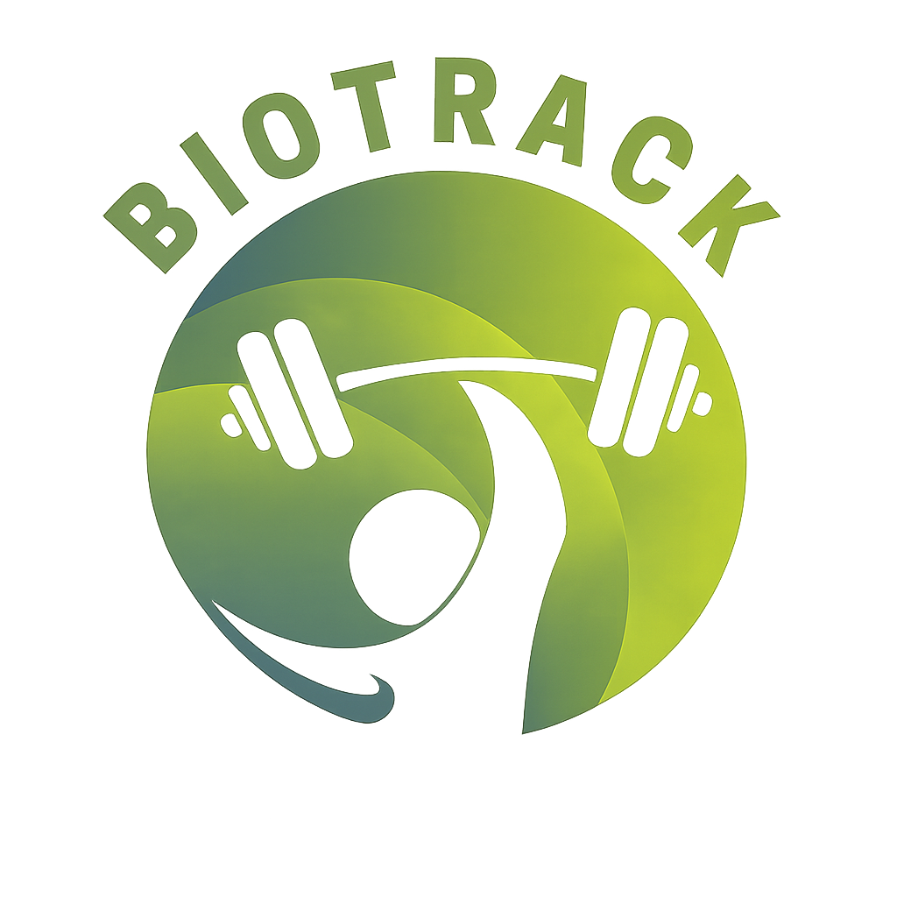

<h1 align="center">BioTrack</h1>

<div align="center">
  
  <br>
  <p><em>A smart, interactive fitness dashboard for tracking your progress, workouts, and goals</em></p>
</div>

---

## 📚 Table of Contents

- [About the Project](#about-the-project)
- [Used Technologies](#used-technologies)
- [Project Structure](#project-structure)
- [Contributors](#contributors)
- [Documentation](#documentation)
- [Download](#download)

---

<a id="about-the-project"></a>
## 🎯 About the Project

Our project is centered around the idea of creating a smart and engaging fitness dashboard that helps users easily track their personal progress, workouts, and goals in one place. It aims to present fitness data in a clear, visually appealing, and interactive way, encouraging users to stay motivated and consistent in their training.

By combining progress tracking and training resources, the dashboard simulates a real-life fitness assistant that supports users in building and maintaining a healthy lifestyle.

The project is built entirely with **HTML5**, **CSS3**, and **vanilla JavaScript (ES6)** — no external libraries or frameworks. It is fully responsive, working across desktop, tablet, and mobile devices.

---

<a id="used-technologies"></a>
## 🛠️ Used Technologies

| Logo | Tool | Purpose |
| :--: | :--- | :------ |
|  | [HTML5](https://developer.mozilla.org/en-US/docs/Web/HTML) | Page structure and semantic markup |
|  | [CSS3](https://developer.mozilla.org/en-US/docs/Web/CSS) | Styling, Flexbox, Grid, animations |
|  | [JavaScript (ES6)](https://262.ecma-international.org/) | Interactivity and DOM manipulation |
|  | [Visual Studio Code](https://code.visualstudio.com/) | Primary IDE |
|  | [GitHub](https://github.com/) | Version control and collaboration |
|  | [Microsoft Word](https://en.wikipedia.org/wiki/Microsoft_Word) | Documentation |
|  | [Microsoft PowerPoint](https://en.wikipedia.org/wiki/Microsoft_PowerPoint) | Presentation |
|  | [Microsoft Teams](https://www.microsoft.com/bg-bg/microsoft-teams/group-chat-software) | Team communication |

---

<a id="project-structure"></a>
## 📁 Project Structure
```
BioTrack/
│
├── index.html              ← Main dashboard page
│
├── pages/
│   ├── workouts.html       ← Full workouts page with filter + add form
│   ├── goals.html          ← Goals, badges, and progress bars
│   ├── tutorials.html      ← Video tutorial library with category filter
│   ├── contact.html        ← Contact form with info cards
│   ├── privacy.html        ← Privacy policy document
│   └── auth.html           ← Combined login and sign up page
│
├── styles/
│   ├── styles.css          ← Global styles (shared across all pages)
│   ├── workouts.css        ← Styles specific to workouts.html
│   ├── goals.css           ← Styles specific to goals.html
│   ├── tutorials.css       ← Styles specific to tutorials.html
│   ├── contact.css         ← Styles specific to contact.html
│   ├── privacy.css         ← Styles specific to privacy.html
│   └── auth.css            ← Styles specific to auth.html
│
├── scripts/
│   ├── script.js           ← JavaScript for index.html
│   ├── workouts.js         ← JavaScript for workouts.html
│   ├── goals.js            ← JavaScript for goals.html
│   ├── tutorials.js        ← JavaScript for tutorials.html
│   ├── contact.js          ← Form validation and submission for contact.html
│   └── privacy.js          ← Scroll progress and section highlights for privacy.html
│
├── assets/                 ← Images and icons
│
└── README.md
```

---

<a id="contributors"></a>
## 👥 Contributors

| Name | GitHub | Contact |
| :--- | :----- | :------ |
| **Sofia Chapkina** (9v) | [SACHapkina24](https://github.com/SACHapkina24) | [SACHapkina24@codingburgas.bg](mailto:SACHapkina24@codingburgas.bg) |
| **Vsevolod Bolotov** (9v) | [VYBolotov24](https://github.com/VYBolotov24) | [VYBolotov24@codingburgas.bg](mailto:VYBolotov24@codingburgas.bg) |
| **Juliana Stoykova** (9v) | [JYStoykova24](https://github.com/JYStoykova24) | [JYStoykova24@codingburgas.bg](mailto:JYStoykova24@codingburgas.bg) |

---

<a id="documentation"></a>
## 📄 Documentation

| Document | Link |
| :------- | :--- |
| 📝 Word Document | [BioTrack.docx](https://github.com/codingburgas/2526-dual-education-biotrack-2.git) |
| 📊 PowerPoint Presentation | [BioTrack.pptx](https://github.com/codingburgas/2526-dual-education-biotrack-2/raw/refs/heads/main/BioTrack/docs/BioTrack.pptx) |

---

<a id="download"></a>
## ⬇️ Download

Clone the repository by running:

```bash
git clone https://github.com/codingburgas/2526-dual-education-biotrack-2.git
```

Or download it directly as a ZIP from [**here**](https://github.com/codingburgas/2526-dual-education-biotrack-2/archive/refs/heads/main.zip).

---

<h3 align="center">Thanks for checking out BioTrack! Show us some ❤️ by giving it a ⭐️</h3>
